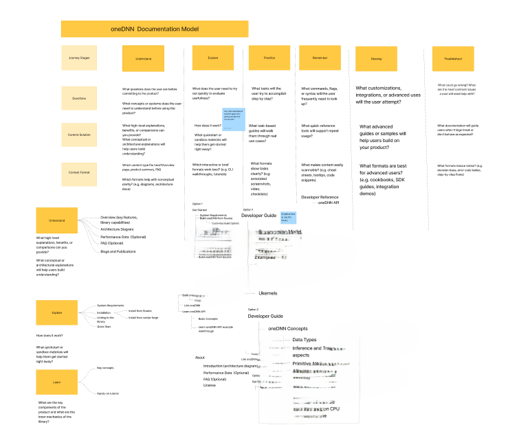

# Writing & Content Strategy Samples

A showcase of my documentation and content strategy work across AI/ML, cloud services, and developer tools.

## Content Strategy and Technical Writing

<div class="project-grid">
    <div class="project-card" onclick="scrollToSection('onednn-project')">
        <h3>Intel oneAPI oneDNN Documentation</h3>
        <p>Led content redesign project for Intel's Deep Neural Network Library, implementing new information architecture based on user research and competitive analysis. Improved user satisfaction score by 30% and readability score by 20%.</p>
        <div class="tags">
            <span class="tag">AI/ML</span>
            <span class="tag">Content Strategy</span>
            <span class="tag">Information Architecture</span>
            <span class="tag">Developer Documentation</span>
        </div>
        <a href="#" class="read-more" onclick="event.stopPropagation(); scrollToSection('onednn-project')">Read More →</a>
    </div>

    <div class="project-card" onclick="scrollToSection('netapp-project')">
        <h3>NetApp BlueXP REST API Documentation</h3>
        <p>Designed and implemented structural framework for documenting cloud REST API workflows, increasing developer satisfaction by 20%. Created comprehensive API documentation including endpoints, request/response examples, and authentication flows.</p>
        <div class="tags">
            <span class="tag">Cloud Computing</span>
            <span class="tag">REST API</span>
            <span class="tag">Developer Docs</span>
            <span class="tag">OpenAPI</span>
        </div>
        <a href="#" class="read-more" onclick="event.stopPropagation(); scrollToSection('netapp-project')">Read More →</a>
    </div>
</div>

## Process Improvement

<div class="project-grid">
    <div class="project-card">
        <h3>API Reference Automation Program</h3>
        <p>Managed automation program for publishing auto-generated API reference content at NetApp. Streamlined the documentation pipeline, reducing manual effort and ensuring synchronization with code releases.</p>
        <div class="tags">
            <span class="tag">Automation</span>
            <span class="tag">Program Management</span>
            <span class="tag">API Documentation</span>
        </div>
    </div>

    <div class="project-card">
        <h3>OpenAPI Specification Templates</h3>
        <p>Created internal templates for structuring and editing OpenAPI specification files. This standardization improved team efficiency and reduced editing errors by 10%, while ensuring consistency across all API documentation.</p>
        <div class="tags">
            <span class="tag">Templates</span>
            <span class="tag">OpenAPI</span>
            <span class="tag">Process Optimization</span>
        </div>
    </div>

    <div class="project-card">
        <h3>Documentation Workflow Optimization</h3>
        <p>Designed and implemented improved documentation workflows using JIRA and Confluence. Created project tracking systems that improved team collaboration and reduced documentation delivery timelines by 15%.</p>
        <div class="tags">
            <span class="tag">JIRA</span>
            <span class="tag">Confluence</span>
            <span class="tag">Agile</span>
        </div>
    </div>

    <div class="project-card">
        <h3>Cross-functional Collaboration Framework</h3>
        <p>Established effective communication channels between documentation, engineering, product, and QA teams. Implemented review processes that caught issues early and improved documentation accuracy.</p>
        <div class="tags">
            <span class="tag">Team Collaboration</span>
            <span class="tag">Stakeholder Management</span>
            <span class="tag">Quality Assurance</span>
        </div>
    </div>

    <div class="project-card">
        <h3>Content Audit & Improvement Initiative</h3>
        <p>Conducted comprehensive content audit of Intel oneDNN documentation, identifying gaps, inconsistencies, and opportunities for improvement. Implemented changes that increased readability scores by 20%.</p>
        <div class="tags">
            <span class="tag">Content Audit</span>
            <span class="tag">Quality Metrics</span>
            <span class="tag">Readability</span>
        </div>
    </div>

    <div class="project-card">
        <h3>Code Sample Testing & Validation</h3>
        <p>Established rigorous testing procedures for code samples in documentation. Tested all REST API examples using Postman in collaboration with QA teams to ensure accuracy and reliability.</p>
        <div class="tags">
            <span class="tag">Code Testing</span>
            <span class="tag">Quality Assurance</span>
            <span class="tag">Postman</span>
        </div>
    </div>
</div>

---

<div id="onednn-project"></div>

## Intel oneAPI Deep Neural Network Library Documentation

**Content strategy redesign and information architecture implementation**

### Context

#### Project Background

Intel oneAPI Deep Neural Network Library (oneDNN) is a critical open-source performance library used by AI and machine learning developers worldwide. The library's documentation was experiencing low adoption rates and user satisfaction scores, indicating a need for comprehensive content strategy overhaul.

**Challenge:** The existing documentation structure made it difficult for developers to find information quickly, onboarding was confusing, and the content wasn't aligned with actual developer workflows. User feedback indicated frustration with navigation and lack of clear getting-started paths.

**Stakeholders:** Engineering teams, product managers, UX researchers, open-source community contributors, and end-users ranging from ML researchers to AI framework engineers.

**Goal:** Redesign the documentation architecture to improve discoverability, enhance user satisfaction, and accelerate developer onboarding while maintaining technical accuracy and comprehensive coverage.

### Process

**Step 1: Persona Analysis**

My first step was to understand the audience I'm writing for. I interviewed product and engineering teams at Intel to get an insight into the persona, understand their typical workflow to onboard and get started with the library.


**Step 2: Content Audit**

I completed a comprehensive audit of existing documentation pages, identifying gaps, redundancies, outdated content, and areas with poor readability scores that caused friction during developer onboarding.

**Step 3: Journey Mapping**

I created detailed developer journey maps for the key persona and mapped pain points and opportunities at each stage.


**Step 4: Competitive Analysis**

I analyzed competitor documentation to identify best practices and opportunities for differentiation.

**Step 5: Information Architecture Design and Building a Learning Path**

Designed new documentation structure using card sorting and tree testing with actual users. Organized content around user tasks rather than technical components.



**Step 6: Measurement & Optimization**

I tracked key metrics (user satisfaction, page views, bounce rates) and continued optimizing content based on data insights.


### Key Results

<div class="contact-info">
    <div class="contact-card">
        <h3 style="font-size: 2.5rem; color: var(--primary); margin: 0;">30%</h3>
        <p style="color: var(--text-light); margin-top: 0.5rem;">User Satisfaction Increase</p>
    </div>
    <div class="contact-card">
        <h3 style="font-size: 2.5rem; color: var(--primary); margin: 0;">20%</h3>
        <p style="color: var(--text-light); margin-top: 0.5rem;">Readability Improvement</p>
    </div>
    <div class="contact-card">
        <h3 style="font-size: 2.5rem; color: var(--primary); margin: 0;">10%</h3>
        <p style="color: var(--text-light); margin-top: 0.5rem;">Adoption Rate Increase</p>
    </div>
</div>

### GitHub Contributions

Sample pull requests demonstrating documentation improvements and content strategy implementation:

- [Restructure Getting Started section with improved navigation](https://github.com/uxlfoundation/oneDNN/pull/3380)
  
  Redesigned the Getting Started section with step-by-step instructions, code examples, and clear learning path for key user persona.

- [Add developer journey-based information architecture](https://github.com/uxlfoundation/oneDNN/pull/3376)
  
  Implemented new documentation structure based on user research and journey mapping, organizing content by tasks rather than technical components.

- [Rewrote Examples and Tutorials page to improve navigation](https://github.com/uxlfoundation/oneDNN/pull/3326)
  
  Enhanced the Tutorials and Examples page with practical code examples, common use cases, and troubleshooting tips based on user feedback.

### My Role & Responsibilities

- Conducted competitive analysis
- Created detailed developer journey maps to identify content gaps
- Performed comprehensive content audit of existing documentation
- Designed and implemented new information architecture
- Wrote Get Started guides that simplified onboarding
- Collaborated with engineering and UX teams throughout the project

### Technical Skills Applied

- Documentation tools: Sphinx, RestructuredText, VSCode, Git/GitHub
- Content modeling and core content strategy principles
- UX research methodologies including journey mapping and usability testing
- Analytics-driven decision making for content optimization
- Cross-functional collaboration with engineering, product, and UX teams

[View Live Documentation](https://uxlfoundation.github.io/oneDNN/index.html)

---

<div id="netapp-project"></div>

## NetApp BlueXP REST API Documentation

### Context

#### Project Background

NetApp BlueXP is a platform that enables management of hybrid multicloud architecture for enterprise developers. The platform supports several features such as auditing, tenancy, and more and the corresponding APIs enable to access the resources to integrate into developer applications.

**Challenge:** User feedback indicated that comprehensive API documentation was necessary. There was inconsistency across product in terms of voice, tone, and style. The existing legacy structure made it difficult for developers to find information quickly.

**Stakeholders:** Engineering teams, product managers, community contributors, and end-users including enterprise developers.

**Goal:** Write and maintain REST API documentation while maintaining technical accuracy and comprehensive coverage. Create a service template to standardize documentation of APIs across product. Validate code samples to produce technically accurate documentation.

### API Documentation Sample: Tenancy Service

Complete API documentation for the BlueXP Tenancy service, demonstrating comprehensive endpoint documentation, authentication flows, and developer guidance.

#### Overview

The Tenancy service provides secure and granular role-based access control (RBAC) for the resources in the BlueXP platform when using BlueXP in restricted mode or private mode. The service operates within the context of a BlueXP account. The identity of the API caller and the account are established through a user or service token.

It consists of several internal major components that operate together to enable and restrict resource access.

**Components:**
- account
- authorize
- resource
- service account
- user
- workspace

**Note:** Before using the API reference documentation, review the Get started section for the BlueXP APIs. For more information about the security tokens and identifiers you'll need when using the API, review the Common workflows and tasks section.

#### API Versioning

The API version is included in the URL path. The current version is `v1`. Backward compatibility is maintained within major versions and deprecation notices are provided at least six months before removing endpoints.

#### Authentication

The Tenancy API uses API key authentication with Bearer tokens. All requests must include an `Authorization` header with a valid API key.

**Obtaining an API Key**

Generate the user token using the Auth0 authentication service:

```bash
curl --location --request POST 'https://netapp-cloud-account.auth0.com/oauth/token' \
--header 'Content-Type: application/json' \
--data @JSONinput
```

**Input Parameters:**

```json
{
    "username": "user@my-company-demo.com",
    "scope": "openid profile",
    "audience": "https://api.cloud.netapp.com",
    "client_id": "<CLIENT_ID>",
    "grant_type": "password",
    "password": "userpassword",
    "Realm": "Username-Password-Authentication"
}
```

**Output:**

```json
{
    "access_token": "<USER_TOKEN>",
    "id_token": "<ID_TOKEN>",
    "scope": "openid profile cc:update-password",
    "expires_in": 86400,
    "token_type": "Bearer"
}
```

#### Using Your API Key

1. **(Optional) Locate the Console agent ID and client ID** - Several Console APIs require a Console agent ID to route the request to the appropriate environment.

2. **Obtain the access tokens** - Depending on the REST API call, you might need a user token, a service token, or both. These tokens can be obtained from the Auth0 authorization service.

3. **Create the required request headers**
   - `Authorization`: Contains the user bearer access token
   - `x-agent-id`: Contains the agent ID for API calls that require it

4. **Issue a REST API call** - You can use curl or the programming language of your choice to issue a REST API call.

#### REST Implementation

**HTTP Methods:**

| Method | Description |
|--------|-------------|
| POST | Create an object instance |
| GET | Retrieve an object instance or collection |
| PATCH | Update an existing object |
| DELETE | Remove an existing object |

**Request Headers:**

| Request Header | Description |
|----------------|-------------|
| Authorization | Required. Contains a JWT access token |
| X-service-request-id | Used to tag a request with application-specific keys |
| X-agent-id | Contains the BlueXP Connector ID |
| X-tenancy-account-id | Contains the account identifier |

**HTTP Status Codes:**

| Status Code | Description |
|-------------|-------------|
| 200 | OK: Returned for successful operation completion |
| 400 | Bad Request: Returned if the input is malformed |
| 401 | Unauthorized: Returned if authentication failed |
| 403 | Forbidden: Returned for authorization errors |

#### GET /tenancy/account/{accountId}

Retrieves a specific account by an account identifier.

**Parameters:**

| Name | Type | In | Required | Description |
|------|------|-----|----------|-------------|
| accountId | string | path | True | Account identifier |
| authorization | string | header | True | JWT access token |
| X-User-Token | string | header | False | User token |
| X-Service-Request-Id | string | header | False | Request tracking ID |

**Response (Status 200):**

| Name | Type | Required | Description |
|------|------|----------|-------------|
| accountPublicId | string | False | Public account ID |
| accountName | string | False | Account name |
| accountSerial | string | False | Account serial number |

**Example Response:**

```json
{
  "accountPublicId": "string",
  "accountName": "string",
  "accountSerial": "string"
}
```

**cURL Example:**

```bash
curl -X GET "https://cloudmanager.cloud.netapp.com/tenancy/resource?account=<account_id>" \
-H "accept: application/json" \
-H "authorization: <user token>"
```

### API Workflow Documentation

Comprehensive workflow documentation for creating Cloud Volumes ONTAP systems using REST APIs.

#### Create a Cloud Volumes ONTAP System

You can create a new Cloud Volumes ONTAP system using capacity-based licensing. You can add new volumes when creating the system.

**Note:** When using capacity-based license:
- A marketplace subscription is required
- If you purchase a license from NetApp (BYOL), a NetApp Support Site (NSS) key is required

**Choose the Workflow Based on Deployment Type:**

- **Single Node:** Create a single node Cloud Volumes ONTAP system
- **HA Pair:** Create a high availability Cloud Volumes ONTAP system

**Create a System for a Single Node:**

**Step 1: Select the Region**
Perform the workflow `Get regions` and choose the `code` value for the `region` parameter.

**Step 2: Select the Workspace**
Perform the workflow `Get tenants` and choose the `workspacePublicId` value for the `tenantId` parameter.

**Step 3: Select the Permutations Configuration**
Perform the workflow `Get permutations` and choose the `ontapVersion`, `license: type`, and `instanceType` values.

**Step 4: Select the Capacity Package Name**

Three licensing options available:
- Professional
- Essentials
- Freemium

**Step 11: Create the System**

**HTTP Method and Endpoint:**

| HTTP Method | Path |
|-------------|------|
| POST | /occm/api/vsa/working-environments |

**cURL Example:**

```bash
curl --request POST \
--location "https://api.bluexp.netapp.com/occm/api/vsa/working-environments" \
--header "x-agent-id: <AGENT_ID>" \
--header "Authorization: Bearer <ACCESS_TOKEN>" \
--header "Content-Type: application/json" \
--d @JSONinput
```

**JSON Input Example:**

```json
{
  "name": "bycapacitycvo",
  "tenantId": "workspace-ksJa8vEY",
  "region": "us-east-1",
  "packageName": "aws_custom",
  "dataEncryptionType": "AWS",
  "vsaMetadata": {
    "ontapVersion": "ONTAP-9.11.1RC1.T1",
    "licenseType": "capacity-paygo",
    "instanceType": "m5.2xlarge",
    "capacityPackageName": "Professional"
  },
  "writingSpeedState": "NORMAL",
  "svmPassword": "password",
  "vpcId": "vpc-a762xx00",
  "ebsVolumeType": "gp3",
  "ebsVolumeSize": {
    "size": 1,
    "unit": "TB"
  }
}
```

**Note:** My GitHub contributions to this documentation are no longer publicly accessible as the repository has been reorganized. The published documentation reflects my work on API reference content, workflow documentation, and OpenAPI specifications.

### Key Results

<div class="contact-info">
    <div class="contact-card">
        <h3 style="font-size: 2.5rem; color: var(--primary); margin: 0;">20%</h3>
        <p style="color: var(--text-light); margin-top: 0.5rem;">Developer Satisfaction Increase</p>
    </div>
    <div class="contact-card">
        <h3 style="font-size: 2.5rem; color: var(--primary); margin: 0;">10%</h3>
        <p style="color: var(--text-light); margin-top: 0.5rem;">Reduced Editing Errors</p>
    </div>
    <div class="contact-card">
        <h3 style="font-size: 2.5rem; color: var(--primary); margin: 0;">40+</h3>
        <p style="color: var(--text-light); margin-top: 0.5rem;">API Workflows Documented</p>
    </div>
</div>

### My Role & Responsibilities

- Wrote API documentation for services such as Tenancy, Audit, Recovery and Backup
- Created a service template to standardize documentation across APIs
- Wrote 40+ REST API workflows for AWS, Azure, Google Cloud that align with developer workflows
- Designed and implemented new information architecture for documenting the REST API workflow
- Wrote API explorer guide allowing developers to test endpoints real-time
- Validated code samples in the API documentation
- Collaborated with engineering, product, and QA teams throughout the project

### Technical Skills Applied

- Documentation tools: AsciiDoc, JSON, Jekyll, VSCode, Git/GitHub
- API documentation principles
- OpenAPI specification, Swagger, Postman
- Cross-functional collaboration with engineering, product, and QA teams

[View Live Documentation](http://docs.netapp.com/us-en/console-automation/index.html)
